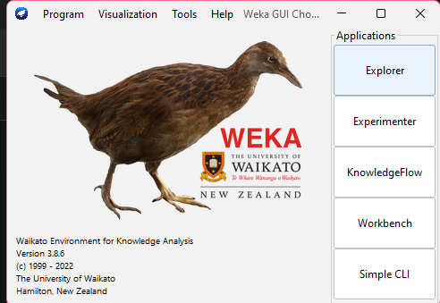
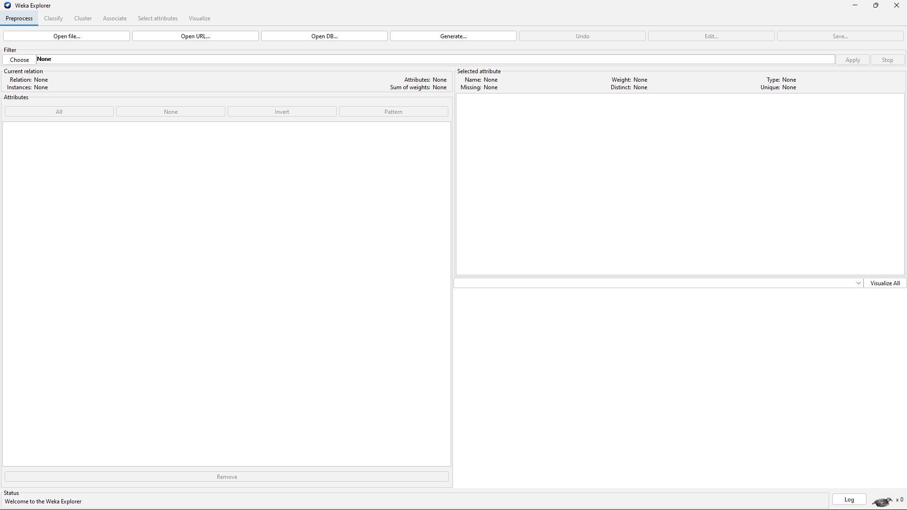
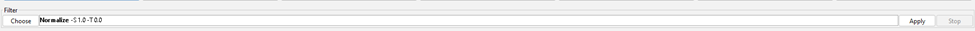
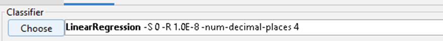
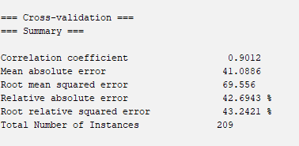
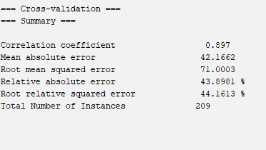
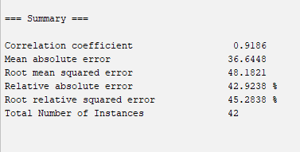

# 
WEKA
 

WEKA - an open source software provides tools for data preprocessing, implementation of several Machine Learning algorithms, and visualization tools so that you can develop machine learning techniques and apply them to real-world data mining problems. 

## WEKA - INSTALLATION 

To install WEKA on your machine, visit [WEKA’s official website](https://ml.cms.waikato.ac.nz/weka) and download the installation file.   WEKA supports installation on Windows, Mac OS X and Linux.

## Weka Explorer

There are several tabs on the title bar 
- Preprocess
- Classify
- Cluster
- Associate
- Select Attributes
- Visualize

## LAB 1

### What is Regression ?

Regression is a statistical approach used to analyze the relationship between a dependent variable (target variable) and one or more independent variables (predictor variables). The objective is to determine the most suitable function that characterizes the connection between these variables.

It seeks to find the best-fitting model, which can be utilized to make predictions or draw conclusions.

It is a supervised machine learning technique, used to predict the value of the dependent variable for new, unseen data. It models the relationship between the input features and the target variable, allowing for the estimation or prediction of numerical values.

### Types of Regression

There are two main types of regression:

**Simple Regression**
- Used to predict a continuous dependent variable based on a single independent variable.
- Simple linear regression should be used when there is only a single independent variable.

**Multiple Regression**
- Used to predict a continuous dependent variable based on multiple independent variables.
- Multiple linear regression should be used when there are multiple independent variables.

**NonLinear Regression**
- Relationship between the dependent variable and independent variable(s) follows a nonlinear pattern.
- Provides flexibility in modeling a wide range of functional forms.

### Regression Algorithms
There are many different types of regression algorithms, but some of the most common include:

**Linear Regression**

Linear regression is one of the simplest and most widely used statistical models. This assumes that there is a linear relationship between the independent and dependent variables. This means that the change in the dependent variable is proportional to the change in the independent variables.

**Polynomial Regression**

Polynomial regression is used to model nonlinear relationships between the dependent variable and the independent variables. It adds polynomial terms to the linear regression model to capture more complex relationships.

**Support Vector Regression (SVR)**

Support vector regression (SVR) is a type of regression algorithm that is based on the support vector machine (SVM) algorithm. SVM is a type of algorithm that is used for classification tasks, but it can also be used for regression tasks. SVR works by finding a hyperplane that minimizes the sum of the squared residuals between the predicted and actual values.

**Decision Tree Regression**

Decision tree regression is a type of regression algorithm that builds a decision tree to predict the target value. A decision tree is a tree-like structure that consists of nodes and branches. Each node represents a decision, and each branch represents the outcome of that decision. The goal of decision tree regression is to build a tree that can accurately predict the target value for new data points.

**Random Forest Regression**

Random forest regression is an ensemble method that combines multiple decision trees to predict the target value. Ensemble methods are a type of machine learning algorithm that combines multiple models to improve the performance of the overall model. Random forest regression works by building a large number of decision trees, each of which is trained on a different subset of the training data. The final prediction is made by averaging the predictions of all of the trees.

**Advantages of Regression**

- Easy to understand and interpret
- Robust to outliers
- Can handle both linear and nonlinear relationships.

**Disadvantages of Regression**

- Assumes linearity
- Sensitive to multicollinearity
- May not be suitable for highly complex relationships

## STEPS INVOLVED 

dataset used :- *cpu.arff*

STEP 1:- Normalise the dataset using filters/unsupervised/attribute/Normalise option under preprocess tab

STEP 2:- Open Classify menu and choose functions/LinearRegression

STEP 3:- Play around with various test options

#### CROSS VALIDATION TEST

##### 10 FOLDS 

##### 5 FOLDS

#### PERCENTAGE SPLIT

##### 80% 

---

